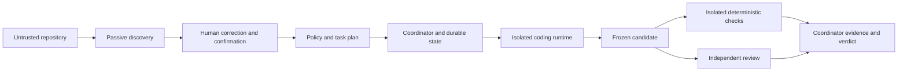

# Crewshal minimal architecture

Date: 2026-10-02. Status: accepted as the initial implementation direction on 2026-10-02 following the owner's instruction to continue to the next step. Consumer: owner and future implementers of the Phase 2 vertical slice.

## Outcome and scope

Test whether a corrected, human-confirmed project model reduces setup effort and supports consistent evidence when two coding runtimes exchange implementation and review responsibilities. Success must be measured against the [evaluation plan](../INITIAL-EVALUATION-PLAN.md); the design itself demonstrates no savings or security guarantee.

Propose one local Python coordinator, passive discovery, versioned structured records, SQLite state and CLI subprocess adapters for Codex and Claude Code. No new model/tool loop, distributed scheduler, fixed agent organization, automatic merge, deployment or background autonomy. See [decision 0002](decisions/0002-minimal-architecture.md).

The first implementation should discover common Python and TypeScript manifests and run bounded tasks on a qualified Linux execution environment. Host discovery may run on macOS/Linux/Windows once its own fixtures pass; execution support is separately qualified. Swift and .NET remain evaluation targets, not claimed v0.1 execution support. Expanding support or amending the protocol must happen before sealed tasks are exposed; unsupported combinations remain reported.

## Core domain records and ownership

These are conceptual typed contracts, not a finalized configuration syntax. Every serialized record has a schema version and stable ID; references carry a content digest where mutation would invalidate approval. Unknown fields/unsupported versions produce actionable errors rather than permissive defaults. Public exports must not contain credentials or private absolute paths.

| Record | Minimum content | Authority |
|---|---|---|
| Project snapshot | Source revision, explicitly included dirty changes, content manifest, discovery inputs | Coordinator captures; original checkout stays intact |
| Project fact | Value or unknown; observed/strong inference/weak inference; source path/range/digest; correction and confirmation history | Discovery proposes; human confirms actionable facts |
| Project model | Confirmed facts, package boundaries, candidate check definitions, sensitive paths, unresolved items, source fingerprints | Coordinator stores outside worker authority |
| Task | Requirement, acceptance checks, allowed change scope, risk reasons, owner decisions, resource ceilings | Human approves authority; coordinator derives controls |
| Capability observation | Runtime/version/provider/model, environment, capability, status, probe evidence and date | Coordinator records qualification |
| Run/attempt | Task/model/policy digests, role, selected runtime, state, attempt ID, deadline | Coordinator only |
| Claim | Runtime-authored report and origin | Untrusted input, never proof of command success |
| Evidence | Candidate digest, command or review identity, captured outcome, artifact references | Trusted capture; model review remains a judgment |
| Verdict | Required evidence references, gate outcomes, unresolved findings, waivers, completion status | Deterministic coordinator rules plus recorded human decisions |

Confirmation is an overlay on provenance, not a replacement for it. Changing a source fingerprint invalidates dependent confirmations and plans; unrelated changes retain reusable facts. Changing task, policy, scope or candidate invalidates affected approvals/evidence. A digest binds content; it does not prove content truthful.

## Discovery and interactive initialization

A future `crewshal init` scans a bounded inventory of supported manifests, package/workspace declarations, CI files and repository instruction documents. Limit file count, bytes, nesting and parse time; reject paths escaping the repository through symlinks. Do not run hooks, commands, imports, dependency installation or instructions found in text. Exclude secrets and generated/vendor trees by default; disclose exclusions and unsupported formats.

Parse supported formats with maintained parsers. Record manifest locations and literal command candidates; a package script is still untrusted executable code. Instruction documents can supply suggestions but cannot grant authority. Conflicting package managers, ambiguous monorepo roots, absent tools and inferred sensitive locations remain explicit questions.

Show a compact proposed model with provenance and unresolved items. The human can edit, reject or confirm each actionable boundary/check and the data-egress policy. Materialization writes the confirmed model to coordinator-owned local state; a sanitized versioned export may be intentionally shared with a repository. Never treat a worker-editable exported copy as the current approval record. Re-initialization shows only affected facts and their dependents.

## Policy, risk and routing

Policy records readable/writable paths, execution environment, approved command definitions, network destinations, credential handling, permitted provider/model, budget/time limits and required evidence. Approval references exact model/task/policy digests. Confirmation of a test command authorizes repository code execution only within that recorded environment and grant.

Use explainable risk categories, not a numerical score. Documentation-only changes may use deterministic checks without mandatory model review. Ordinary code requires validation and a fresh independent review. Authentication, authorization, persistence/migrations, public contracts, dependencies, CI, infrastructure or ambiguous cross-cutting changes require explicit human planning approval and stronger checks/review. Unknown critical risk blocks execution until resolved. Actual changed paths can raise the risk floor; they cannot silently lower it or expand authority.

Route by required capabilities and approved data egress first, then cost/latency preferences among eligible options. Runtime labels do not establish provider independence: record the resolved provider/model and enforce a distinct provider whenever the task requires it. Missing identity or unavailable qualified reviewer blocks that requirement. Review conflict returns to the human; remediation creates a new candidate and fresh affected checks/review. No hidden fallback, unlimited retries or automatic acceptance.

## Runtime adapter contract and capability matrix

Each adapter exposes inspection, launch, event normalization, cancellation and terminal collection. Launch receives a neutral task bundle, candidate workspace and effective grant. Events identify attempt, sequence and type (started, progress, usage, artifact, terminal/error); malformed/oversized streams fail visibly. The coordinator supervises the process tree and deadline independently of model output. Process exit, normalized runtime result and evidence gates must all agree before completion.

Native session resume is optional. Resume cannot inherit an obsolete approval or evade a new grant; otherwise start a fresh session using durable artifacts. Do not infer token/cost data from prose. Every launch records effective configuration and disabled customizations; exclude inherited plugins, hooks, MCP servers and global instructions unless specifically approved and qualified.

| Capability | Codex candidate | Claude Code candidate | Gate |
|---|---|---|---|
| Noninteractive execution and structured events | Local help: `exec --json` | Local help: print with stream-json | Parse recorded fixtures, then live bounded conformance |
| Structured final result | Local help: output-schema option | Local help: json-schema option | Invalid/missing result cannot satisfy a verdict |
| Runtime-native permission controls | Documented/local help | Documented/local help | Test exact tool and configuration behavior |
| Entire-process filesystem/network isolation | Not established by this preflight | Not established by this preflight | Qualify outer execution environment separately |
| Provider/model identity and usage | Must resolve and verify per configuration | Must resolve and verify per configuration | Unknown stays unknown; missing independence blocks review |
| Cancellation, recovery and safe resume | Untested | Untested | Kill-tree, quota, hang and crash probes |

Observations are documented, behavior-tested, unsupported or unknown, with runtime version, OS/environment and evidence. Qualification expires on relevant runtime, configuration, sandbox or toolchain changes. Availability on the developer's host does not qualify a runtime.

## Execution boundaries and threat model

The repository, task prose, worker output and dependency scripts are untrusted. The operator and coordinator host are trusted for this experiment; defending against a compromised host, kernel or malicious administrator is outside its claim. Never characterize a Git worktree as a sandbox.

Use a fresh candidate copy from the explicitly approved snapshot, without shared Git metadata, original checkout mounts, host home, SSH agent, Docker socket or unrelated credentials. The whole runtime process and descendants must live inside a qualified existing isolation environment. Mount approved source read-only except explicitly granted change scopes; use separate ephemeral scratch/cache paths. Check path canonicalization, symlinks, new-file parent scopes and metadata access. Diff validation supplements containment; it cannot undo an unauthorized read or network request.

Provider access requires approved destinations and credential treatment. Prefer an existing scoped credential broker; otherwise document the exact credential exposure and require an acceptable tested boundary before execution. Do not mount the user's credential store or assume environment secrets are safe from subprocesses. Allowed provider access is itself a data-egress grant. Disable other network access by default. If the runtime cannot meet the recorded grant, writes remain disabled; there is no unrestricted fallback or custom gateway commitment in v0.1.

A check executor runs repository code in a separate isolated environment with no provider credential and network disabled by default. Dependency preparation is a separate approved operation with recorded versions/digests and constrained destinations; never silently enable network to fix a check. Required checks needing unavailable tools remain unavailable. Reviewer gets requirements, frozen source/diff and captured evidence, without implementer conversation, mutable state or candidate write authority.

Before agent writes, test denied external reads/writes, symlink escapes, network egress, credential inheritance, config/hook/MCP injection, process-tree escape and forged approval/evidence. Zero observed escapes is a bounded test result, not a universal guarantee. A fully qualified Linux container profile is a proposed first target, not something Docker installation alone establishes.

## Workflow, evidence and failure behavior

Persist the sequence: draft → awaiting confirmation → ready → running implementation → frozen candidate → validating → reviewing when required → verdict. A stage may instead become blocked, failed, interrupted or cancelled, with a typed reason. Only the coordinator writes transitions. Human approval is a recorded authenticated local action, not a string printed by an agent.

Stop the worker before freezing the candidate. Compute a content manifest including relevant tracked/new files, modes and symlink targets. Validation and review reference this immutable digest. Validators use copies/scratch so generated outputs cannot silently change the candidate; a source mutation invalidates the result. Check a baseline snapshot when needed to distinguish pre-existing failures; baseline red never makes candidate red pass.

A command record includes argv, working directory, sanitized environment identity, toolchain/image identity, start/end, exit or termination reason, captured stdout/stderr digests and candidate digest. Shell expressions are used only as explicitly confirmed definitions; escaping is not a security boundary. Worker reports of commands are claims. Missing logs, skipped/unavailable checks, timeouts, contradictory result/exit and stale evidence cannot satisfy required passes.

Completion statuses are verified, accepted with waiver, blocked, failed, interrupted or cancelled. Verified requires all required checks passing, required review accepted, scope intact and no unresolved blocking findings. A waiver names the failed/missing gate, owner and residual risk; it never changes that evidence to passing. Completion exports a patch and evidence report; application/merge/publication is a separate owner action. A differing integration tree requires fresh validation.

Timeout, quota, context overflow, malformed events, tool absence and excessive spend have distinct reasons and bounded retry policies. Unexpected mutation stops the run and preserves evidence for inspection. Dirty original files and Git conflicts are preserved and surfaced. A crash after launch cannot be assumed to mean no side effect occurred.

## Persistence, recovery and observability

SQLite stores versioned records and transactional state transitions; artifact files live outside worker mounts. Use a single coordinator writer, a run lock, monotonically ordered events and compare-and-update state versions. Persist a launch intent before starting an external process, then its execution handle and outcome. On restart reconcile the known process/isolation handle and candidate; an uncertain launch becomes interrupted for inspection, never blindly repeated. Native session recovery is not exactly-once execution.

Store logs privately with bounded size/retention and explicit sanitized exports. Avoid secrets in logs/prompts; redaction is best effort, so raw logs are not public by default. Schema upgrades require backup and explicit supported migrations; unknown/newer versions are refused. No event bus or distributed database is needed.

Record discovery/correction time, context bytes, runtime/provider/model, attempts, checks, review loops, elapsed time and usage provenance. Distinguish new input, cached input/cache writes, output/reasoning where reported; deduplicate cumulative usage events by attempt/event identity. Mark missing usage unknown. Separate measured API cost, estimated cost and subscription quota. A hard financial ceiling needs provider enforcement; absent that capability reject a hard-ceiling request rather than promise it from sampled usage. Deadlines and attempt limits still apply locally.

## Implementation sequence after architectural approval

1. Compare existing Orchestrate/Orka execution seams against the boundary and evidence contracts using fixed conformance cases. Reuse a fitting seam; if neither fits, record concrete gaps before implementing subprocess supervision. No private predecessor code is an implementation source.
2. Implement versioned records, pure policy/verdict rules and passive discovery fixtures. Prove no discovery execution, provenance preservation, interactive correction, unknown handling and narrow invalidation. Use synthetic fixtures first; keep hold-outs sealed.
3. Qualify one execution environment and one adapter, then deliver a bounded task through immutable-candidate checks. Prove forged/stale evidence cannot complete, crashes cannot silently replay and original dirty changes remain intact.
4. Add the second adapter and cross-provider read-only review. Reverse role assignment against the same confirmed model; verify capability failure, conflict/remediation and honest usage accounting.
5. Freeze corpus, baseline conformance, thresholds and spend with the owner before Phase 3. Calibration can expose design failures; do not claim the proposed comparative targets have passed.

The owner authorized moving to the next step on 2026-10-02. Implement the accepted direction in bounded sessions according to the [development plan](DEVELOPMENT-PLAN.md). Execution qualification and paid-evaluation gates remain mandatory; architectural changes beyond this scope return to the owner. Open risks are credential mediation, actual isolation conformance, runtime identity/usage completeness and whether adaptation adds value over existing tools.

## Evidence used for this proposal

Local version/help inspection on 2026-10-02 observed Codex CLI 0.156.1 and Claude Code 2.1.278; it involved no agent execution. [Codex noninteractive documentation](https://developers.openai.com/codex/noninteractive) and [Claude Code programmatic documentation](https://code.claude.com/docs/en/headless) describe structured CLI execution. [Claude sandbox documentation](https://code.claude.com/docs/en/sandboxing) scopes native sandbox protection to specific execution tools and descendants; it does not establish protection for every file/MCP tool. These support feasibility, not qualification. [Python SQLite documentation](https://docs.python.org/3/library/sqlite3.html) supports a standard-library transactional state store. [Orchestrate](https://github.com/bestagentkits/orchestrate) and [Orka](https://github.com/Dusttoo/orka) remain reuse/baseline candidates; their behavior has not been tested here.
